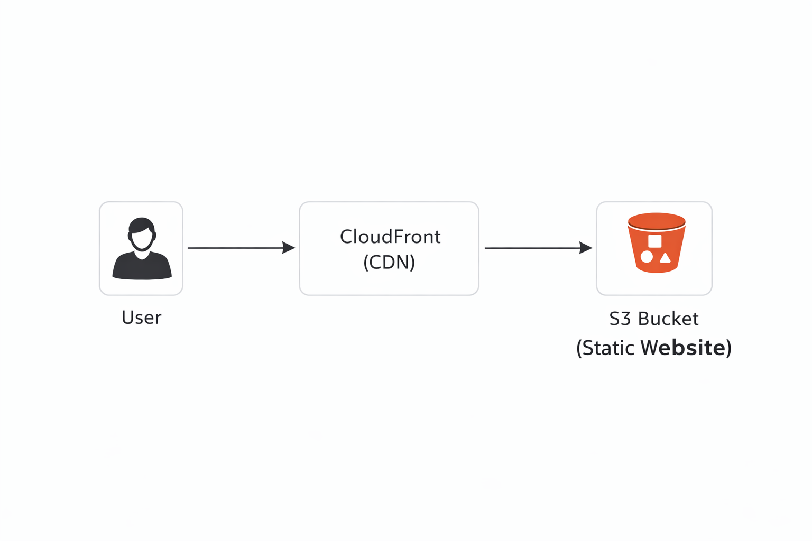

# 🌐 Project 01: Static Website Hosting using AWS S3 & CloudFront

---

## 📌 Objective

To deploy a static website using AWS S3 and enhance its performance and global availability using CloudFront.

---

## 📖 Project Description

This project demonstrates how to host a static website using Amazon S3 and distribute it globally with low latency using AWS CloudFront. The setup ensures high availability, scalability, and faster content delivery.

---

## 🛠️ AWS Services Used

* Amazon S3 (Simple Storage Service)
* Amazon CloudFront (Content Delivery Network)

---

## 🏗️ Architecture Diagram

---

## ⚙️ Implementation Steps

### Step 1: Login to AWS Console

Access AWS Management Console.

### Step 2: Create S3 Bucket

* Navigate to S3 service
* Create a bucket with a unique name

### Step 3: Disable Block Public Access

* Uncheck "Block all public access"
* Save changes

### Step 4: Upload Website Files

* Upload index.html and style.css files

### Step 5: Enable Static Website Hosting

* Enable static hosting
* Set index document as `index.html`

### Step 6: Add Bucket Policy

* Allow public read access to objects

### Step 7: Create CloudFront Distribution

* Open CloudFront service
* Create a new distribution

### Step 8: Configure Origin

* Select S3 bucket as origin
* Configure default settings

### Step 9: Access Website

* Use CloudFront domain URL to access the website

---

## 📸 Screenshots

## 📸 Screenshots

### 🔹 S3 Bucket Creation

---

### 🔹 Upload Files to S3

---

### 🔹 Static Website Hosting Configuration

---

### 🔹 Bucket Policy Configuration

---

### 🔹 Website Output (S3)

---

### 🔹 CloudFront Configuration

---

### 🔹 Final Output (CloudFront)

---

## 🌍 Output

The website is successfully hosted and accessible globally using CloudFront with low latency.

---

## 💡 Key Learnings

* Static website hosting using S3
* Content delivery using CloudFront
* Managing public access using bucket policies
* Understanding AWS global infrastructure

  ## 🎤 Interview Explanation

This project demonstrates hosting a static website using AWS S3 and improving performance using CloudFront.

First, I created an S3 bucket and uploaded static files like HTML and CSS. Then I enabled static website hosting and configured a bucket policy to allow public access.

After that, I created a CloudFront distribution and connected it to the S3 bucket. CloudFront caches the content and delivers it through edge locations, which improves performance and reduces latency.

Finally, I accessed the website using the CloudFront URL, ensuring global availability and faster content delivery.

---

## ⚡ Key Points for Interview

* S3 is used for storage
* CloudFront is used as CDN
* Bucket policy allows public access
* CloudFront improves speed using caching
* Website is globally accessible

---

## 👨‍💻 Author

Mahesh
